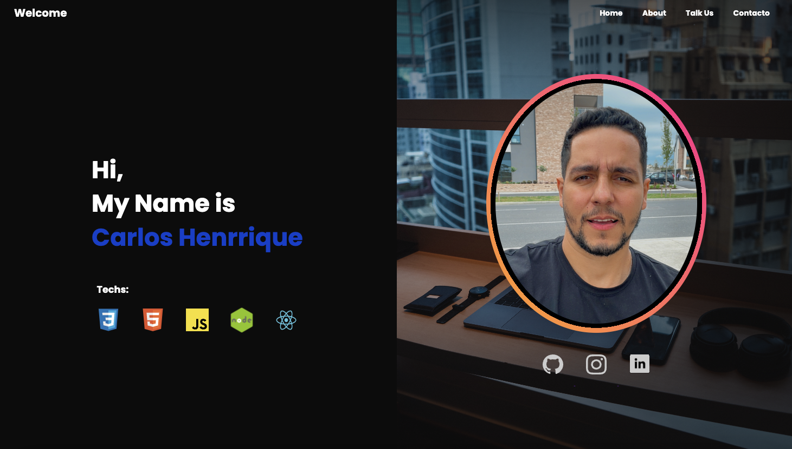
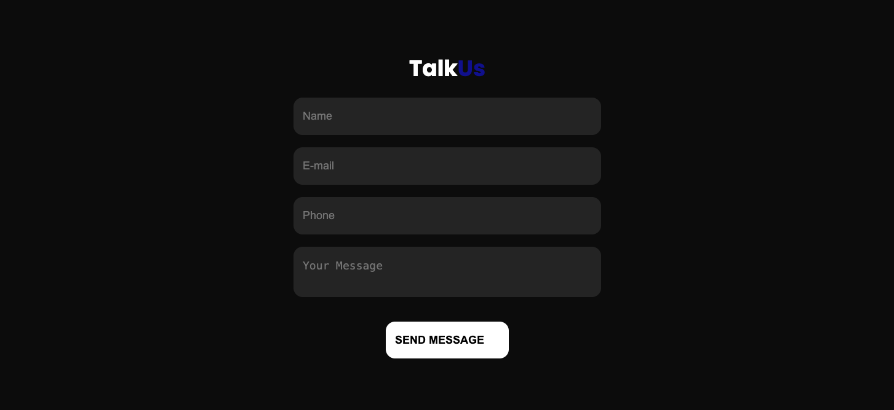
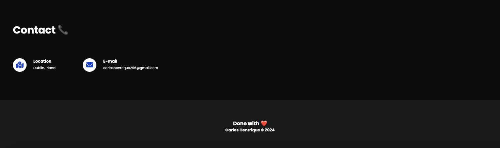
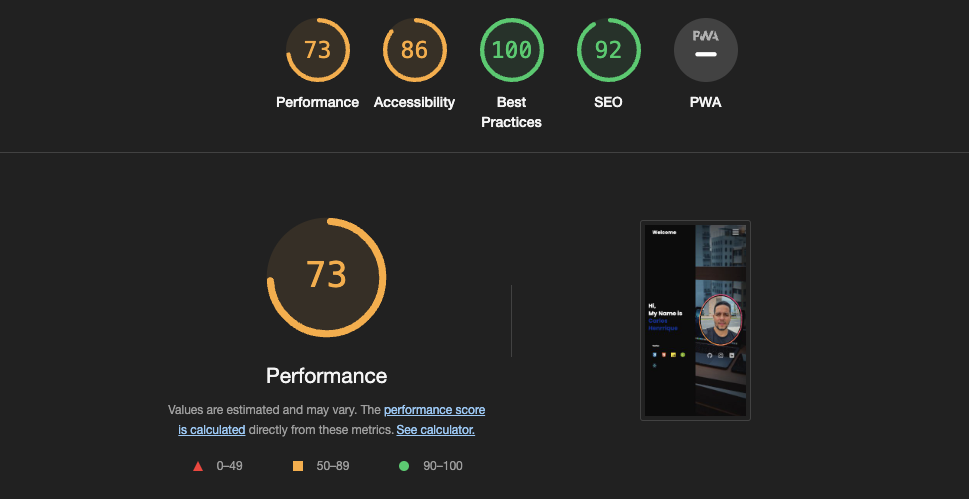

# Carlos Henrrique's Portfolio

Carlos Henrrique's Portfolio is a personal website showcasing the skills, projects, and contact information of Carlos Henrrique, a junior full-stack developer. The website aims to provide visitors with insights into Carlos's background, expertise, and professional experience.

---

Technologies Used:

- HTML5
- CSS3

---

## Technologies Used:

### 1. Header Section:

Navigation menu for easy access to different sections of the website.
Responsive design for seamless navigation on various devices.

### 2. About Section:

Introduction to Carlos Henrrique, including a profile image and brief bio.
List of technologies (stacks) Carlos is proficient in.

### 3. About Us Section:

Detailed description of Carlos Henrrique's background, skills, and experience.
Downloadable presentation letter.

### 4. Talk Us Section:

Form for visitors to contact Carlos Henrrique.
Fields for name, email, phone, and message.

### 5. Contacts Section:

Contact information including location and email address.
Contact icons for easy reference.

### 6. Footer Section:

Declaration of completion and ownership.

### Validator Testing:

## image
I have used the recommended HTML W3C Validator to validate all of my HTML files.
[Link-Validator](https://validator.w3.org/)

### Lighthouse Audit
I have used the recommended Lighthouse Validator to validate all of my files.

##### Responsiveness
I've tested my deployed project on multiple devices to check for responsiveness issues.

**Mobile Iphone (DevTools)

**Mobile Samsung(DevTools)

**Desktop

---

Credits:
Font Awesome for icons.
Images and SVGs sourced from external files.
Ivo Junior Channel Brazilian for help.
Code Institute School for educational resources.

---
Author:
Carlos Henrrique
Student: Code Institute School

---

Contact Information:
For inquiries or collaborations, 
contact Carlos Henrrique via email at carloshenrrique296@gmail.com

[link-email](carloshenrrique296@gmail.com)

[link-repository](https://github.com/soucarloshenrrique/project01code.git)

[link-website-](https://portfolio-chv-project1.netlify.app/)

Carlos Henrrique's Portfolio! 🚀
