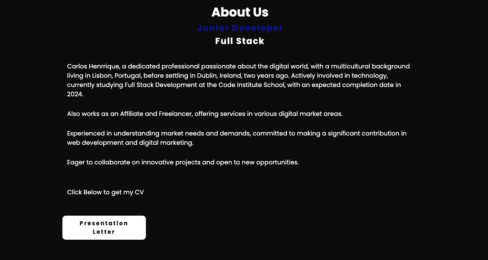

# Carlos Henrrique's Portfolio

Carlos Henrrique's Portfolio is a personal website showcasing the skills, projects, and contact information of Carlos Henrrique, a junior full-stack developer. The website aims to provide visitors with insights into Carlos's background, expertise, and professional experience.

---

Technologies Used:

- HTML5
- CSS3

---

## Technologies Used:

### 1. Header Section:

Navigation menu for easy access to different sections of the website.
Responsive design for seamless navigation on various devices.

### 2. About Section:

Introduction to Carlos Henrrique, including a profile image and brief bio.
List of technologies (stacks) Carlos is proficient in.

### 3. About Us Section:

Detailed description of Carlos Henrrique's background, skills, and experience.
Downloadable presentation letter.

### 4. Talk Us Section:

Form for visitors to contact Carlos Henrrique.
Fields for name, email, phone, and message.

### 5. Contacts Section:

Contact information including location and email address.
Contact icons for easy reference.

### 6. Footer Section:

Declaration of completion and ownership.

Testing

I tested that this page works in different browsers: chrome, firefox, safari

I confirmed that this project is responsive, looks good and functions on all standard screen sizes using the dev tools device toolbar.

I CONFIRMED THAT THE NAVIGATION, HEADER, ABOUT , FORMS and contact text are all readable and easy to understand.

I have confirmed that the form works: requires entries in every field, will only accept an email in the email field, and the submit button works.

### Validator Testing:

Accessibility

I confirmed that the colours and fonts chosen are easy to read and accessible by running it through lighthouse in dev tools

---

Credits:
Font Awesome for icons.
Images and SVGs sourced from external files.
Ivo Junior Channel Brazilian for help.
Code Institute School for educational resources.

---
Author:
Carlos Henrrique
Student: Code Institute School

---

Contact Information:
For inquiries or collaborations, 
contact Carlos Henrrique via email at carloshenrrique296@gmail.com

[link-email](carloshenrrique296@gmail.com)

[link-repository](https://github.com/soucarloshenrrique/project01code.git)

Carlos Henrrique's Portfolio! 🚀